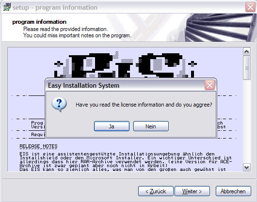

# Easy Installation System - written in Win32 assembly

An easy to use and highly customizable but compact installation library (formerly knwon as warez installer) which extracts files from an attached .rar archive an uses an customizable installation script to properly configure the installation.

## Implemented Features

+ Support for all 32-bit Windows versions in use today - Windows 95, 98, 2000, XP, Me, NT 4.0. - there is no need for additional runtime libraries.
+ Supports creation of a single EXE to install your program for easy online distribution. Disk spanning is also supported.
+ Standard wizard interface, including support for the latest Windows 2000/XP wizard style.
+ Complete uninstall capabilities.
+ Made for RAR 3.0 archive files for one of the best compressions available today
+ Creation of shortcuts including in the Start Menu and on the desktop.
+ Creation of registry and .INI entries.
+ Full source code is available (MASM32 v8).
+ Supports JPEG file format pictures
+ very small
+ Supports password encrypted archives (with encrypted filennames)
+ Different language versions (english, german)
+ Customizable user interface (text, icons, images etc.)
+ Approximately 80-120k overhead over compressed data size for a full featured wizard
+ Ability to display a license agreement, text or ASCII style
+ Installers can be as large as 2GB (theoretically -- when building on Win9x the limit seems to be around 500MB, however building on NT then installing on Win9x works with larger sizes)
+ Supports batch-file scripting for custom installations that include
  + File extraction (with configurable overwrite parameters)
  + File/directory copying, renaming, deletion, searching
  + DLL/ActiveX control registration/deregistration
  + Executable execution (shell execute and wait options)
  + Shortcut creation
  + Registry key setting/deleting
  + INI file reading/writing
  + Generic text file reading/writing
  ? Error checking
  + Reboot support, including delete or rename on reboot
  + User functions in script

## Missing features

- Installer self-verification using a CRC32
- Ability to detect destination directory from the registry, and let the user override (or not let them)
- Fully multilingual, support for multiple languages in one installer. More than 35 translations are available.
- Silent install and uninstall.
- Multiple install configurations (usually Minimal, Typical, Full), and custom configuration
- User selection of installation components, treeview for component selection
- Batch file scripting
  - Registry key reading/enumerating
  - Powerful string and integer manipulation (only with W2k++)
  - Window finding based on class name or title
  - User interface manipulation (font/text setting)
  - Window message sending
  - User interaction with message boxes or custom pages
  - Branching, comparisons, etc.
  - Installer behaviour commands (such as show/hide/wait/etc)
